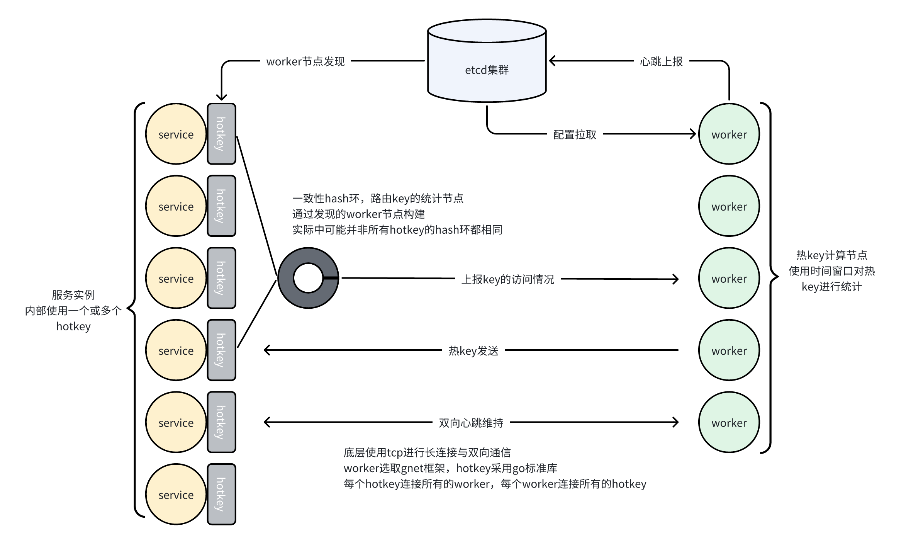

# hotkey-go：自动热点发现，轻松解决热key问题  

## 简介

这是一个热key发现中间件，快速发现热点，发现后，加入本地缓存或者限流，由使用者决定，降低热点对下游服务造成的冲击。  

该中间件分为两部分，go包hotkey，计算节点worker，worker节点可以水平扩展，hotkey将key的访问数据发送至worker进行计算，若成为热key则通知hotkey
## 快速开始

### 启动worker节点

更改worker目录下worker.go的配置
```go
func main() {
    // etcd地址，本机ip+port，port与下面的port保持一致
	err := service.RegisterService([]string{"1jian10.cn:4379"}, "1jian10.cn:23030", "worker/"+strconv.FormatInt(time.Now().UnixNano(), 10))

	if err != nil {
		panic(err.Error())
	}
    // 将端口号设置为
	err = server.Serve("tcp://0.0.0.0:23030")
	if err != nil {
		panic(err.Error())
	}
}
```
一键启动
```shell
go run worker.go #执行go run一键启动
```

### 使用hotkey

在etcd中添加配置，key为group/{groupName}，value为yaml格式的配置，效果如图
  
连接etcd，传入etcd的client以及groupName，groupName需要与在etcd中添加的groupName相同  
```go
	client, err := etcd.New(etcd.Config{
		Endpoints:   []string{"1jian10.cn:4379"},
	})
    core, err := hotkey.NewCore("test", client)
    value,ok:=core.Get("key")
    if core.IsHotKey("key"){
        // ...
    }
```

## 使用详解

### 初始化

#### 初始化接口  

groupName：同一group下值相等的key视为同一个key，会一起统计，一个group即是一个分组  
client：etcd的client
options：初始化选项，传入hotkey中提供的with...以更新默认配置
```go
func NewCore(GroupName string, client *etcd.Client, options ...Option) (*Core, error) {
}
```

#### 初始化选项
更改core中的本地缓存的大小，size表示byte，默认值为4GB
```go
func WithCacheSize(size int) Option {}
```
更改core中热key缓存的大小，size表示byte，默认值为128MB
```go
func WithKeySize(size int)Option{}
```
更改一致性hash中worker节点映射的虚拟节点的数量，相同group请使用相同的值，否则热key统计将会不准确，默认值为50
```go
func WithVirtualNums(nums int) Option {}
```
更改core发送channel的大小，默认值为1024*512
```go
func WithChannelSize(size int) Option {}
```
更改core发送key的间隔，默认值为100ms，过小影响性能，过大影响实时性
```go
func WithSendInterval(interval time.Duration) Option {}
```
将观察者加入观察者队列
```go
func WithObserver(observers ...Observer) Option {}
```
设置热key缓存时间，默认值为30s
```go
func WithTTL(ttl int) Option {}
```

### core
从本地缓存中获取value
```go
func (c *Core) Get(key string) ([]byte, bool) {}
```
将kv加入本地缓存
```go
func (c *Core) Set(key string, value []byte, ttl int) bool {}
```
从本地缓存中删除kv
```go
func (c *Core) Del(key string) bool {}
```
判断一个key是否是热key，即判断本地热key缓存中是否有这个key
```go
func (c *Core) IsHotKey(key string) bool {}
```

### 观察者
通过WithObserver将观察者加入观察者列表，在将热key加入本地热key缓存前将会轮询调用这些通知这些观察者  
可以看到，观察者为一个interface，只要实现do接口即为观察者，若该任务耗时不可忽略，请将key发送到channel异步处理，避免阻塞  
```go
type Observer interface {
	Do(key string)
}
```

### worker配置
```yaml
Group:
  #group名称
  Name: test
Window:
  # 窗口个数，每个窗口100ms
  Size: 20
  # 成为热key后多久才可以再次判断为热key
  TimeWait: 60  #second
  # 窗口总访问次数阈值，达到该阈值即判断为热key
  Threshold: 10 
  # 超时时间，一个key超过该时长没有访问则清理掉，避免内存泄露
  Timeout: 120  #second
```

## 整体概览

### 架构图


### 注册中心
首先，worker需要具有水平扩展的能力，而我们的hotkey需要感知到worker节点的变更，很明显，这里需要引入注册中心来实现  
这里选取的是etcd，etcd本身并不提供注册中心的api，一般自己实现服务注册与发现  
worker作为服务提供方将ip+port注册到etcd中，上报心跳维持etcd中的服务信息  
hotkey在启动时先获取所有worker节点信息，在通过watch worker/ ，来获取worker节点的变更信息  
服务注册与发现细节不做解释，随便一搜就有很多结果

### 配置中心与热更新
在进行热key的统计时，需要对配置进行实时的更新以应对不同的场景，将配置写在各个节点，一个个更改节点的配置信息显然是不可接受的，这里就需要引入配置中心来进行统一的配置调控  
由于已经选取了etcd作为注册中心，为了不引入其他组件，这里依旧使用etcd作为配置中心，配置中心依旧自己实现  
同时，配置更新作用于所有worker节点，重启节点是不可接受的，若热更新配置，需要解决并发问题  
worker节点启动时拉取所有配置，之后watch group/，获取配置变更信息并进行热更新  
热更新实现细节在下文进行详解

### 长连接
worker与hotkey需要进行双向通信，也即全双工的通信协议，这里选取tcp作为底层通信协议  
worker作为被动连接方，也即是server，选取gnet作为tcp框架  
由于在windows上开发，gnet对window的client支持不完善，这里采取go标准库的net来实现client  

### 路由
当发送key到worker时，需要选取发送到的worker节点，而且尽量保证相同的key在不同的hotkey实例中路由到相同的worker节点  
worker的热key统计基于单机，若分散在多台机器上，则key的统计将会及不精确，同时对worker节点的内存也会造成较大的压力    
这里采取一致性hash的路由方式，相较于hash路由的方式，在worker节点变动时，能大幅降低key的迁移数量  
由于各实例网络情况的差异，不能保证每个hotkey与worker的连接都相同，使用一致性hash也能保证路由结果相似  

### 批量发送
io操作比较耗时，若每次访问key立即发送key到worker节点，则会对机器造成较大的负载  
这里采取批量发送的方式，在内存中聚合消息，每隔一段时间发送一条聚合消息  
假设一个读接口，qps为1w，若不聚合，每秒io数最少为1w，采取每100ms发送一次的聚合策略，io数直接降低到常数级别  能够大幅降低负载  

## 实现细节


