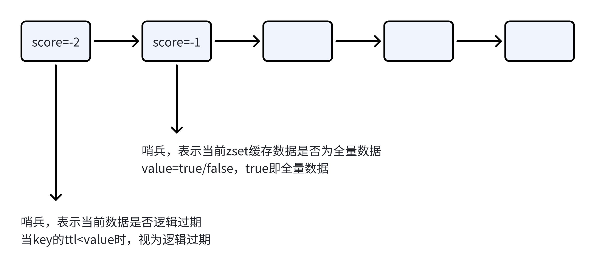
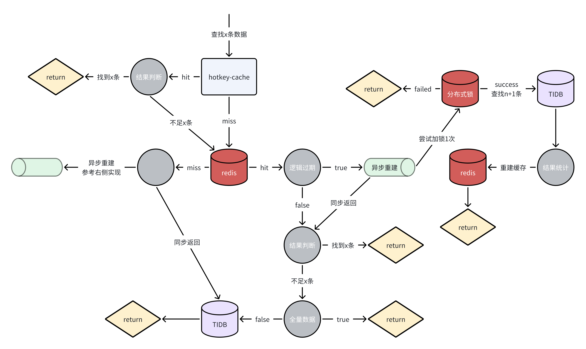

# 服务层
这里对一些通用设计进行解释  
## 缓存
redis的热key对业务有较大的影响，这里通过热点探测+本地缓存进行解决，原理参考[hotkey-go](../pkg/hotkey-go/README.md)  

这里看一下通用的缓存设计，以zset为例,核心便是两个哨兵  
  
首先是逻辑过期的哨兵，通常缓存过期时，我们需要回源tidb进行查找，而这时对tidb压力较大，有着缓存击穿的风险，同时由于db的速度较慢，对于响应速度也有很大影响  
因此，引入逻辑过期，即key的过期时间不由其ttl决定，而是由逻辑过期时间决定  
当逻辑过期时，直接返回旧值，通过异步缓重建缓存，加快响应速度  
但这只解决了响应速度的影响，并没有解决缓存击穿的问题  
这里使用singleflight的思想进行解决，而在分布式环境下，则是使用分布式锁来保证同一key只有一个实例回源db进行查找  

其次是全量数据哨兵，他主要记录了当前zset中存储的数据是否全量(set,hash同理)  
这么做的主要目的是，当一个查询想要查找一定数量的数据，而根据条件在zset中查询到的值的数量小于查找数量，我们无法确认是否需要回源db进行查找，从而全部回源  
因此，我们维护这样一个全量数据的哨兵，从而快速确认是否需要回源db进行查找  

使用以上技术，在业务实现时，逻辑较为复杂，这里给出具体的流程图  
  
该流程还是比较形象的，接下来对其中部分进行解释  
首先是在命中本地缓存，而记录数不足时，这里继续在redis中进行查找，由于在本地缓存中的数据均为热点数据，可能对redis造成较大的压力  
所以，如果想避免这种情况，当数据量不足时，可以直接返回而不继续在redis进行查找  
可以看到，在异步重建流程中，在tidb查找的是n+1条数据  
之所以这样做，是因为，我们需要再zset中维持哨兵，n即为在zset中缓存的数据条数，当在tidb查询到n+1条数据时，全量哨兵设置为false，即zset中未保存全量数据  
在redis未命中时，这里依旧是异步重建，为什么不同步查找并重建  
A：这是因为想要查找的x条数据并不一定是需要缓存在zset中的n条，即并非其子集，无法确定在db查询的条件  
当然，这种情况概率较低，若认为可以忽略，可以修改为同步重建  

