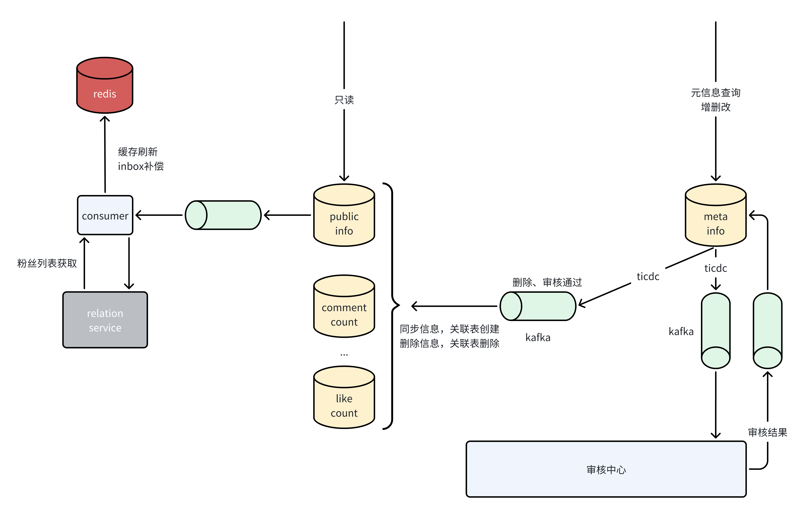
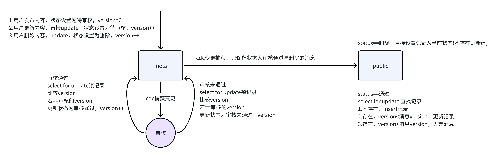

# Content Service
## 初始化
tidb初始化  
```shell
cd internal/model/database/init
go run ini.go
```
进入etc文件夹，修改配置文件  
修改etcd配置，请见[hotkey-go](../../pkg/hotkey-go/README.md),如何配置以启用hotkey  
设置tidb-changefeed同步任务
创建配置文件
```shell
touch test_content_meta.toml 
touch test_content_public.toml
```
分别填入以下配置
```toml
[filter]
rules = ['test.invisible_content_infos']
[sink]
dispatchers=[
    {matcher=['test.invisible_content_infos'],partition="index-value"},
]
```
```toml
[filter]
rules = ['test.visible_content_infos']
[sink]
dispatchers=[
    {matcher=['test.visible_content_infos'],partition="index-value"},
]
```
启动同步任务
```shell 
tiup cdc cli changefeed create --server=http://linux.1jian10.cn:8300 \
--sink-uri="kafka://1jian10.cn:9094/test_content_meta?protocol=canal-json&kafka-version=2.4.0&partition-num=10&max-message-bytes=67108864&replication-factor=1" \
--changefeed-id="test-content-meta" --config="test_content_meta.toml" 
```
```shell 
tiup cdc cli changefeed create --server=http://linux.1jian10.cn:8300 \
--sink-uri="kafka://1jian10.cn:9094/test_content_public?protocol=canal-json&kafka-version=2.4.0&partition-num=10&max-message-bytes=67108864&replication-factor=1" \
--changefeed-id="test-content-public" --config="test_content_public.toml" 
```
## 详解  
这是整体的设计

[content](../../internal/model/database/content_table.go)点击以查看表设计 
### 需求与问题
首先，用户需要发布内容，发布后还需要对其进行更新，删除  
同时，用户发布的内容可能有着违法，不符合平台规范的行为，因此，在用户发布内容后不能立即展示，而是先做审核，审核通过才可以展示  
用户随时可能对内容进行操作，若审核时将该条记录锁住直到审核结束，对用户的体验不佳，若不上锁，我们无法得知审核期间元数据的修改，这是第一个问题  
对于审核未通过的数据，用什么来禁止其他用户的访问，简单的做法是添加一个标记位，审核通过标记为true，未通过或未审核完毕标记为false  
这显然存在一些问题，比如，若用户在审核通过后将数据进行了修改，这时需要重新进行审核，导致其他用户无法访问该内容，这是第二个问题  

### 解决  
第一个问题，并发保证，这里的操作是在表中维护一个version字段，即版本号，每次对记录进行修改都将版本号+1  
这样一来，审核完毕只需要查看记录中的version字段，若和审核的version相同则认为无修改，否则有修改，审核过程中也无需对记录上锁，而是操作时上锁    
第二个问题，不间断的访问，这里的操作是维护两张表，第一张表存储元信息，第二张表存储对外界可见的信息  
他们之间的同步规则为  
- 用户创建内容：不同步
- 用户修改内容：不同步
- 用户删除内容：同步，删除public表中的记录
- 审核通过：若审核期间无修改则同步，否则审核修改后的内容
- 审核未通过：不同步

这样操作，public中的内容始终为审核通过的内容，同时用户的更新操作不会对线上的访问造成影响  
这也带来了新的问题：同步至public的方案使用的是ticdc+kafka异步更新，他不保证消息顺序消费，即public中的内容不保证最终为审核通过的最新的内容  
这个问题依旧采取上述的version方案  
- public无记录：创建记录，version设置为消息的version
- public记录version>消息version：丢弃消息
- public记录version==消息version：丢弃消息(重复消费)
- public记录version<消息version：更新public记录  
  
这仍然有着问题，比如：  
1. 消费一条消息，version==5，类型为update，此时public表中无记录，在public中创建，version=1
2. 消费一条消息，version==6，类型为delete，此时public表中记录version<消息version，将记录从表中删除  
3. 消费一条消息，version==4，类型为update，此时public表中无记录，在public中创建，version=4  
 
可以看出，顺序执行的结果应该是public中的记录被删除，但version较小的消息在version较大的消息之后消费，导致public中的记录没有被删除  
这个问题的解决方案较为简单，即在记录中维持一个标记位，删除时并不真正删除，而是将标记位设置为删除


### 优化 
该系统拆分为两个服务，public-content(以下简称public),meta-content(以下简称meta)  
- public：只提供写接口，流量极大
- meta：提供读写接口，读写流量都较小
可以看出压力主要在public中，这里依旧采用多级缓存的模式，详情查看[通用设计](../README.md)  

### 模块连接
与feed，comment，like服务相关，待补充
