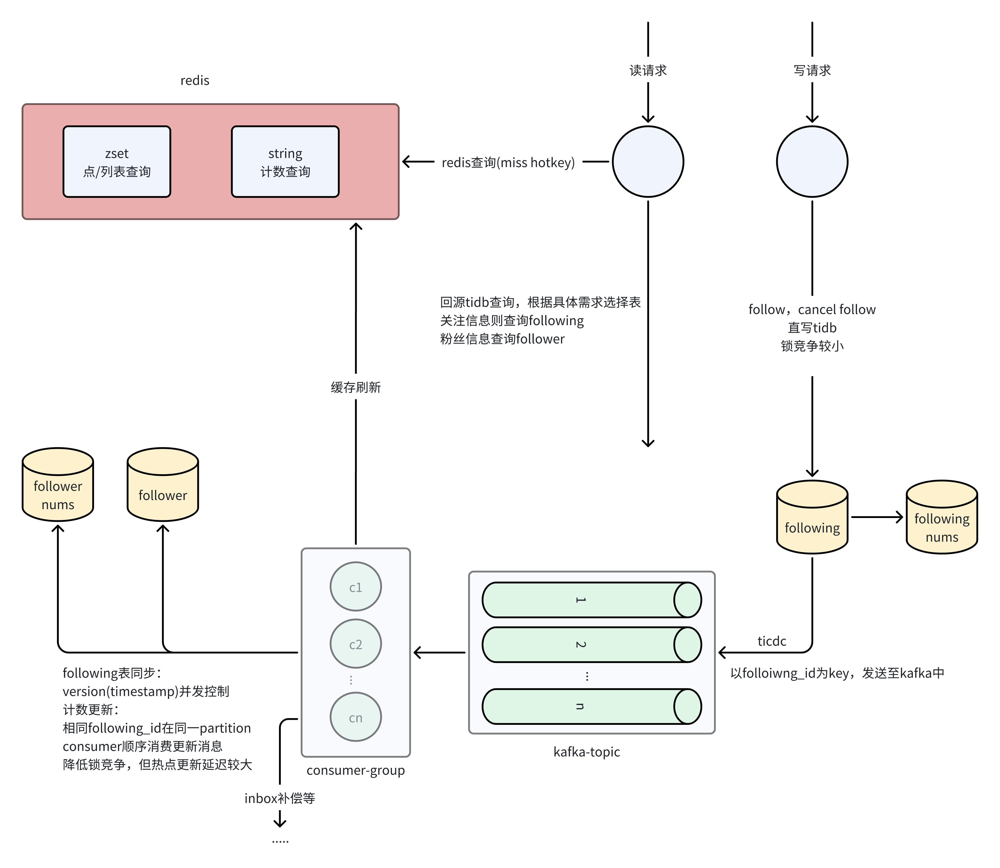

# Relation Service
## 准备工作
在tidb中创建这四张表
```go
type Following struct {
	Id          int64     `gorm:"PRIMARY_KEY"`
	FollowerId  int64     `gorm:"not null;index:following,priority:10"`
	Type        int       `gorm:"not null;index:following,priority:20"`
	FollowingId int64     `gorm:"not null;index:following,priority:30"`
	UpdatedAt   int64     `gorm:"not null;index:following,priority:40;autoUpdateTime:nano"`
	CreatedAt   time.Time `gorm:"autoCreateTime"`
}

type FollowingNums struct {
	UserId int64 `gorm:"PRIMARY_KEY"`
	Nums   int64 `gorm:"not null;default:0"`
}

type Follower struct {
	Id          int64     `gorm:"PRIMARY_KEY"`
	FollowingId int64     `gorm:"not null;index:follower,priority:10"`
	Type        int       `gorm:"not null;index:follower,priority:20"`
	FollowerId  int64     `gorm:"not null;index:follower,priority:30"`
	UpdatedAt   int64     `gorm:"not null;index:follower,priority:40;autoUpdateTime:nano"`
	CreatedAt   time.Time `gorm:"autoCreateTime"`
}

type FollowerNums struct {
	UserId int64 `gorm:"PRIMARY_KEY"`
	Nums   int64 `gorm:"not null;default:0"`
}
```
进入etc文件夹，修改配置文件  
修改etcd配置，请见[hotkey-go](../../pkg/hotkey-go/README.md),如何配置以启用hotkey  
设置tidb-changefeed同步任务
创建配置文件
```shell
touch test_relation_followings.toml 
touch test_relation_followers.toml
```
分别填入以下配置
```toml
[filter]
rules = ['test.followings']
[sink]
dispatchers=[
    {matcher=['test.followings'],partition="columns",columns=["following_id"]},
]
```
```toml
[filter]
rules = ['test.followers']
[sink]
dispatchers=[
    {matcher=['test.followers'],partition="columns",columns=["following_id"]},
]
```
启动同步任务
```shell 
tiup cdc cli changefeed create --server=http://linux.1jian10.cn:8300 \
--sink-uri="kafka://1jian10.cn:9094/test_relation_followers?protocol=canal-json&kafka-version=2.4.0&partition-num=10&max-message-bytes=67108864&replication-factor=1" \
--changefeed-id="test-relation-followers" --config="test_relation_followers.toml"
```
```shell 
tiup cdc cli changefeed create --server=http://linux.1jian10.cn:8300 \
--sink-uri="kafka://1jian10.cn:9094/test_relation_followings?protocol=canal-json&kafka-version=2.4.0&partition-num=10&max-message-bytes=67108864&replication-factor=1" \
--changefeed-id="test-relation-followings" --config="test_relation_followings.toml"
```
## 详解
这是整体的架构图，省略了和feed流相关的逻辑，接下来会对其实现做详细的解释  
  
### 分表
在准备工作时，可能会有这样的疑问，followings和followers这二者除了索引外字段均相同，为什么不直接合并为一张表  
实际上开发初期db采用的是mysql而非tidb，mysql在单表数据量过多时，性能显著下降，需要进行分库分表来扩展其承载能力  
首先确认需求，即点查，和范围查询，点查相对较好解决，问题出现在范围查询  
api中提供了ListFollowing和ListFollower两种接口，二者走的联合索引分别为
- {following_id,type,follower_id,updated_at}
- {follower_id,type,following_id,updated_at}
  
可以看出，从联合索引的第一个位置就不相同  
在进行范围查询的时候，若想降低分表对其影响，即避免跨节点查询，查询的数据应尽量分配到同一节点中  
在这两个查询，前者需要满足相同following_id存储在相同节点，后者需要满足相同follower_id存储在相同节点  
若想同时满足二者，只能将所有数据存储在同一节点，也就无法进行分表操作  
因此，这里将表拆分为两个存有相同数据的表，followings，followers，在写入数据时直写followings，异步将数据同步至follower表  
在进行分表操作时，followings根据following_id进行hash拆分，follower_id根据follower_id进行hash拆分  

当然，后续了解到分布式数据库tidb，可以不分表，直接增加节点来进行水平扩展，从而转向tidb进行开发，不过，由于当前服务具体的实现已经构思完成，实现的时依旧采取旧设计  

### 异步
在处理写请求时，直接写following，following_nums两张表，而将follower,follower_nums的写放到异步处理  
若不这么做，我们需要同步写follower_nums，这时为了保证并发安全，需要使用悲观事务将更新的记录上锁，当某行记录为热点行时，锁竞争会很激烈，从而影响接口的响应速度  
为了避免这种影响，这里采取将更新异步处理，用户在调用接口时，只对自己的计数行上锁，这时可以认为锁竞争为0  
同时，这里也将对redis的更新放到了异步进行处理，即写接口只需关注tidb而无需与redis打交道，这能显著降低接口的复杂度  
异步的方式为ticdc+kafka，写接口不需要将消息投递至kafka，而是在db层面实现的消息投递，这无疑能够降低代码的耦合度  
#### 增量更新
前文提到，将redis的更新做异步处理，对于关注列表和关注数，变更相对不频繁，因此可以使用直接删除redis中的记录的方式来同步redis与tidb  
对于粉丝列表和粉丝数，变更频繁，直接删除是不可取的，这里采取增量更新的方式来进行同步  
#### 消费者优化
使用mq的常见作用为：异步，削峰，解耦。对nums表进行异步更新，无疑是有着削峰的作用的，但是，他只是将当前的处理拖延到了未来处理，并不能提升系统的消费能力
> 这件事很重要，在其他的服务设计中，mq都不只是简单的削峰

前文提到，因为锁竞争导致接口响应速度过慢，若只是异步处理，锁竞争仍然存在，因此，若想提升性能，就要从这方面着手  
在changefeed的配置中，可以设置将相同列投递到相同的partition  
因此，我们设置将所有相同的following_id消息投递到相同的partition，而kafka消费者对相同partition是顺序处理的，这样一来，便将锁竞争消除，变为了顺序处理  
#### 并发
同步following，follower时，为了保证二者的最终一致性，引入了版本号机制，流程如下
查询记录是否存在，若不存在则插入，版本号设置为消息的版本号  
存在，比较版本号：
- 消息version==记录version，当前消息已经消费过了，commit
- 消息version>记录version，当前消息尚未消费，更新记录，commit
- 消息version<记录version，当前消息已经消费过了，或者消费过比他更新的消息，commit
如此操作，即可避免重复消费消息，也可以保证消息乱序时正确的处理

### 缓存
该部分请参考[通用设计](../README.md)，多级缓存和哨兵机制  
由于该部分服务处于早期设计，只实现了其中部分逻辑  

### 其他优化

#### 深度分页
该服务的深度分页主要发生在列表的查询，而我们对关注数量设置了上限，这里分页的问题不必过于担心，主要在于粉丝列表的查询  
考虑到索引的设计，查询的需求等，这里采取的策略为直接禁止掉深分页的查询，从根上解决这个问题

### 模块连接
与feed模块相关，user模块相关，该部分待补充

### 问题与可能的优化
#### 增量更新导致的redis热点 
前文提到，部分场景，redis与tidb的同步采取增量更新的方式，对于部分key，可能会频繁的对其进行更新，产生热key  
对于该问题，可以在消费者端引入批量处理的机制，即当接收到消息时不立即同步至redis，而是先在内存聚合，每3s更新至redis  
由于缓存的特性，短时间的不一致不会有太大的影响
#### 热点造成的消息堆积 
前文提到，将following_id作为key发送至kafka中，由于相同的following_id在相同的partition中，若对该following_id的写流量较多，可能会阻塞当前partition其他消息的处理  
我们可以在消费者端维持hotkey，当判断当前消费的following_id热点数据，不进行处理，而是发送至热点的kafka中处理，避免热点数据对当前partition非热点数据的影响

## 实现参考
[百亿数据百万查询——关系链架构演进](https://www.bilibili.com/opus/803956034838200393)


